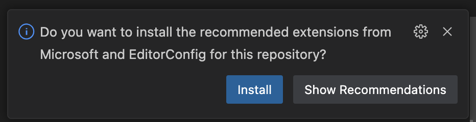
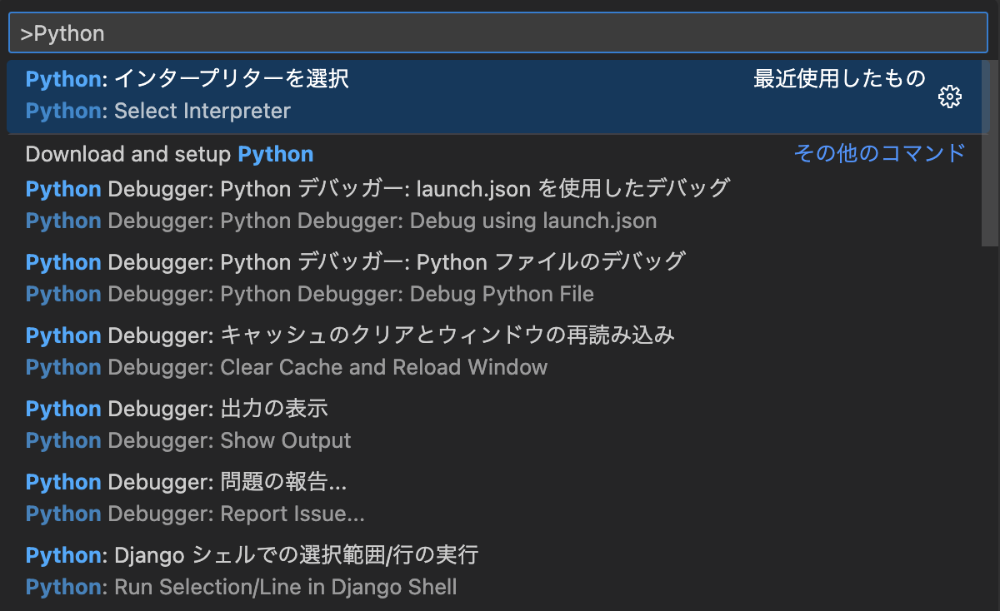
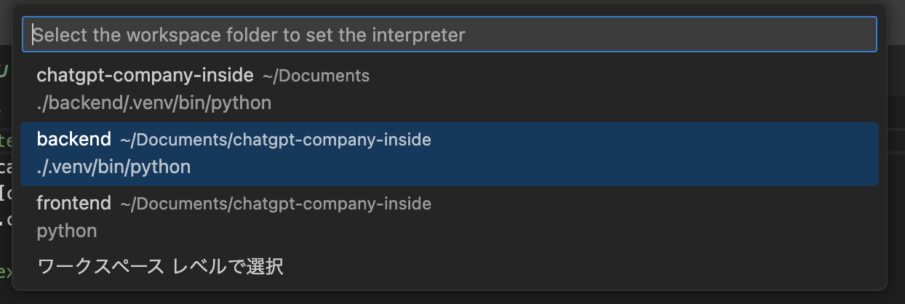
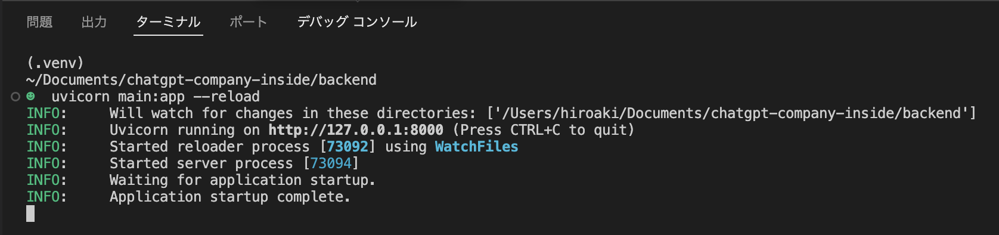
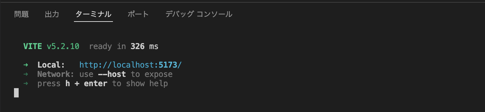
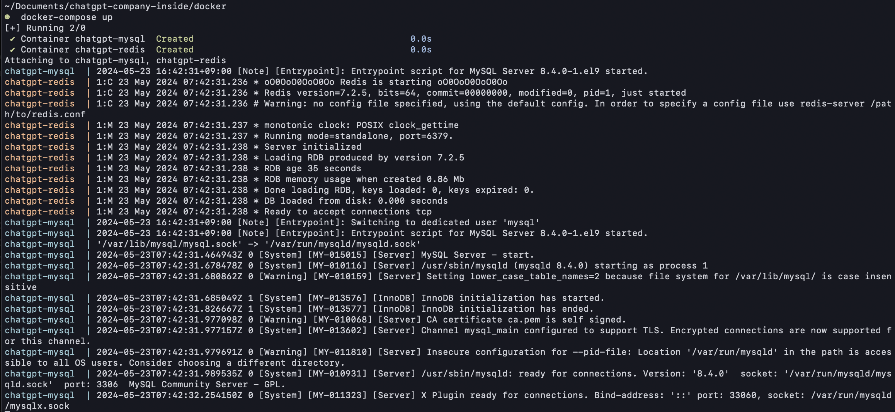

chatgpt-company-inside

## Macの開発環境構築

### Dockerのインストール

[Dockerのサイト](https://docs.docker.com/desktop/install/mac-install/)からDocker Desktop for Macをダウンロードする。


ダウンロードしたdmgファイルを実行する。  
「開発元を検証できません」の警告が出てdmgファイルを開けない場合は、右クリック > 開くから開き直してください。

### Homebrewのインストール

ターミナルから以下のコマンドを実行する。

```bash
/bin/bash -c "$(curl -fsSL https://raw.githubusercontent.com/Homebrew/install/HEAD/install.sh)"
```

### VSCodeのインストール+拡張機能のインストール

ターミナルからHomebrewでVSCodeをインストールする。

```bash
brew install --cask visual-studio-code
```

VSCodeを起動し、メニューの ファイル > フォルダーを開く から、このリポジトリのフォルダを開く。

VSCodeの拡張機能のタブを開くと、このリポジトリが推奨する拡張機能をインストールするか？の確認ポップアップが表示されるので、「Install」を押してインストールする。




### バックエンドのローカル起動

VSCodeのターミナルを起動し、PythonをHomebrewでインストールする。

```bash
brew install python
```

backendのプロジェクトフォルダに移動し、Pythonの仮想環境(venv)を作成する。

```bash
cd backend
python3 -m venv .venv
```

仮想環境内に依存パッケージをインストールする。

```bash
# 仮想環境に入る
source .venv/bin/activate
# 依存パッケージインストール
pip install -r requirements.txt
```

VSCodeのPythonインタープリターの設定を変更する。

Command + Shift + P を押して、「Python: インタープリタを選択」を選択する。



.venvフォルダ配下の、仮想環境のPythonインタープリタを選択する。



VSCodeのターミナルを起動し、下記コマンドを実行してUvicornの開発サーバーを起動する。

```bash
uvicorn main:app --reload
```



別にMacのターミナルアプリなど起動して、以下のコマンドを実行し http://localhost:8000 にアクセスするとAPIが応答する。

```bash
curl http://localhost:8000
```


### フロントエンドのローカル起動

HomebrewでNodejsをインストールする。

```bash
brew install node
```

frontendのプロジェクトフォルダに移動し、npmで依存ライブラリをインストールする。

```bash
cd frontend
npm install
```

VSCodeのターミナルを起動し、下記コマンドを実行してViteの開発サーバーを起動する。

```bash
npm run dev
```



ブラウザで http://localhost:5173 にアクセスすると画面が表示される。


### データベースのローカル起動

事前に、Docker Desktopを起動する。

VSCodeのターミナル、またはMacのターミナルアプリから、dockerのプロジェクトフォルダに移動する。

```bash
cd docker
```

docker-composeでMySQLとRedisのコンテナを起動する。

```bash
docker-compose up
```



起動したコンテナを停止する場合は、docker-composeを実行したターミナルで Ctrl+C を押す。  
ターミナルを閉じてもバックグラウンドでMySQLとRedisを起動させておきたい場合は、以下の通り -d ををつけて起動すること。

```bash
docker-compose up -d
```

## 開発ガイド

### データベースへの接続

データベースに接続する